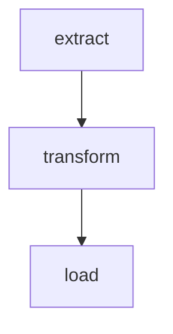
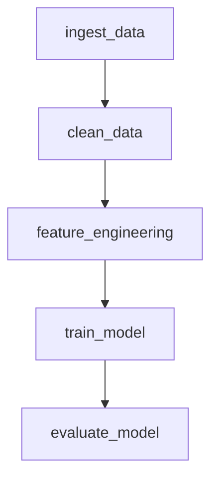
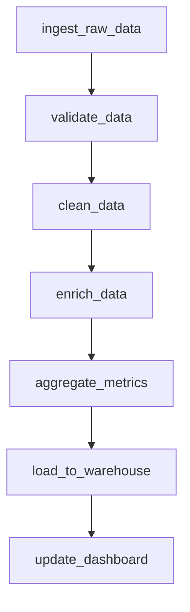

# Databricks Asset Bundle Creator

Generate production-ready Databricks Asset Bundles with modular structure, serverless compute, and automated deployment.

## When to Use This Skill

Use this skill when:
- Setting up a Databricks workflow from multiple notebooks or Python files
- Creating a Databricks job with task dependencies
- Converting an existing pipeline into a Databricks Asset Bundle
- Orchestrating data pipelines with clear execution order
- Deploying reusable Databricks projects across environments (dev/prod)
- Visualizing workflows with Mermaid diagrams or converting diagram images to DABs

## Quick Start Workflow

1. **Define your workflow** using one of three methods:
   - Text description with task dependencies
   - Mermaid diagram file (.mermaid)
   - Workflow diagram image (PNG, JPG, etc.)
2. **Generate DAB structure** - Run generate_dab.py script
3. **Implement task logic** - Add code to src/ files
4. **Deploy and run** - Use run_workflow.sh script

## Key Features

### 🚀 Serverless Compute (Default)
- Uses Databricks Serverless compute (client version 3)
- No cluster configuration needed
- Fast startup and cost-effective
- Can opt-out with `--no-serverless` for traditional clusters

### 📊 Multiple Input Formats
1. **Text descriptions**: Simple task:path format with dependencies
2. **Mermaid diagrams**: Parse flowcharts automatically
3. **Diagram images**: AI-powered extraction from workflow diagrams

### 🏗️ Modular Structure
- **databricks.yml**: Main bundle with variables and includes
- **resources/*.job.yml**: Separate job definitions
- **src/**: Source code (notebooks and scripts)
- **run_workflow.sh**: Deployment and execution script

### ⚙️ Variable Management
- Configurable catalog, schema, paths
- Override variables at runtime
- Environment-specific configurations (dev/prod)

## Input Formats

### 1. Text Description

Simple format for specifying tasks and dependencies:

```
task_name: path/to/file.py
dependent_task: path/to/file.ipynb [depends_on: task_name]
final_task: path/to/final.py [depends_on: task1, task2]
```

**Format rules:**
- One task per line
- Format: `task_name: file_path [depends_on: dependency1, dependency2]`
- Optional leading dash (`-`) for readability
- Dependencies are comma-separated in `[depends_on: ...]`
- Tasks without dependencies have no `[depends_on: ...]` clause
- Comments start with `#`

**Example:**
```
extract: src/extract.py
transform: src/transform.py [depends_on: extract]
load: src/load.py [depends_on: transform]
```

### 2. Mermaid Diagram

Create a flowchart in Mermaid syntax:



Save as `workflow.mermaid` and use:
```bash
scripts/generate_dab.py my_pipeline --mermaid-file workflow.mermaid
```

### 3. Workflow Diagram Image

Take a screenshot or draw a workflow diagram, then parse it:

```bash
# Parse diagram image
scripts/parse_diagram_image.py workflow.png -o tasks.txt

# Generate DAB from parsed tasks
scripts/generate_dab.py my_pipeline -d "$(cat tasks.txt)"
```

**Requirements:**
- Install: `pip install anthropic`
- Set: `export ANTHROPIC_API_KEY=your-api-key`
- Supports: PNG, JPG, GIF, WebP

## Generating the Bundle

### Basic Usage (Text Description)

```bash
scripts/generate_dab.py my_pipeline \
  -d "extract: src/extract.py
      transform: src/transform.py [depends_on: extract]
      load: src/load.py [depends_on: transform]"
```

### From Mermaid Diagram

```bash
scripts/generate_dab.py my_pipeline \
  --mermaid-file workflow.mermaid
```

### From Diagram Image

```bash
# Step 1: Parse image
scripts/parse_diagram_image.py workflow.png -o tasks.txt

# Step 2: Generate bundle
scripts/generate_dab.py my_pipeline -d "$(cat tasks.txt)"
```

### With Custom Configuration

```bash
scripts/generate_dab.py my_pipeline \
  -d "task1: src/task1.py
      task2: src/task2.py [depends_on: task1]" \
  --workspace-host "https://my-workspace.cloud.databricks.com" \
  --output-dir ./my_project
```

### Using Clusters Instead of Serverless

```bash
scripts/generate_dab.py my_pipeline \
  -d "..." \
  --no-serverless
```

## Generated Project Structure

```
my_pipeline/
├── databricks.yml                    # Main bundle configuration
├── resources/
│   └── my_pipeline.job.yml          # Job definition with tasks
├── src/                              # Source code
│   ├── extract.py
│   ├── transform.py
│   └── load.py
├── tests/                            # Unit tests (placeholder)
├── run_workflow.sh                   # Deployment and execution script
└── README.md                         # Documentation
```

## Main Configuration: databricks.yml

```yaml
bundle:
  name: my_pipeline

variables:
  catalog:
    description: Unity Catalog name
    default: main
  schema:
    description: Schema name for tables
    default: my_pipeline
  source_path:
    description: Source data path
    default: /Volumes/${var.catalog}/${var.schema}/source
  checkpoint_path:
    description: Checkpoint location
    default: /Volumes/${var.catalog}/${var.schema}/checkpoints

include:
  - resources/*.yml

targets:
  dev:
    mode: development
    default: true
    workspace:
      host: https://your-workspace.cloud.databricks.com

  prod:
    mode: production
    workspace:
      host: https://your-workspace.cloud.databricks.com
```

## Job Definition: resources/*.job.yml

```yaml
resources:
  jobs:
    my_pipeline_job:
      name: my_pipeline_job

      # Serverless environment configuration
      environments:
        - environment_key: serverless_env
          spec:
            client: "3"

      tasks:
        - task_key: extract
          environment_key: serverless_env
          notebook_task:
            notebook_path: ../src/extract.py
            base_parameters:
              catalog: ${var.catalog}
              schema: ${var.schema}
              source_path: ${var.source_path}

        - task_key: transform
          environment_key: serverless_env
          depends_on:
            - task_key: extract
          notebook_task:
            notebook_path: ../src/transform.py
            base_parameters:
              catalog: ${var.catalog}
              schema: ${var.schema}

        - task_key: load
          environment_key: serverless_env
          depends_on:
            - task_key: transform
          notebook_task:
            notebook_path: ../src/load.py
            base_parameters:
              catalog: ${var.catalog}
              schema: ${var.schema}

      max_concurrent_runs: 1
```

## Deployment Script: run_workflow.sh

Generated script supports:

```bash
# Basic deployment and run
./run_workflow.sh --target dev

# With variable overrides
./run_workflow.sh --target dev \
  --var catalog=my_catalog \
  --var schema=my_schema

# Skip validation
./run_workflow.sh --target dev --skip-validation

# Skip deployment (just run)
./run_workflow.sh --target dev --skip-deployment --job-id 12345

# With Databricks profile
./run_workflow.sh --profile my-profile --target prod
```

### Script Parameters

| Parameter | Description | Example |
|-----------|-------------|---------|
| `--profile` | Databricks CLI profile | `--profile production` |
| `--target` | Deployment target (dev/prod) | `--target prod` |
| `--skip-validation` | Skip bundle validation | `--skip-validation` |
| `--skip-deployment` | Skip deployment step | `--skip-deployment` |
| `--job-id` | Run existing job by ID | `--job-id 12345` |
| `--var` | Override variables (repeatable) | `--var catalog=main` |

## Understanding Task Dependencies

Tasks execute based on their dependencies:

**No dependencies** → Runs immediately when job starts
**Has dependencies** → Runs only after all dependencies complete successfully

### Example Execution Flow

```
- extract_sales: src/extract_sales.py          # Runs first (parallel)
- extract_inventory: src/extract_inventory.py  # Runs first (parallel)
- merge: src/merge.py [depends_on: extract_sales, extract_inventory]  # Runs after both
- analyze: src/analyze.py [depends_on: merge]  # Runs last
```

## Common Dependency Patterns

### Linear Pipeline (Sequential)
```
extract → transform → load
```

```bash
scripts/generate_dab.py etl_pipeline \
  -d "extract: src/extract.py
      transform: src/transform.py [depends_on: extract]
      load: src/load.py [depends_on: transform]"
```

### Parallel Processing with Merge
```
extract_a ─┐
           ├─→ merge → report
extract_b ─┘
```

```bash
scripts/generate_dab.py parallel_pipeline \
  -d "extract_a: src/extract_a.py
      extract_b: src/extract_b.py
      merge: src/merge.py [depends_on: extract_a, extract_b]
      report: src/report.py [depends_on: merge]"
```

### Fan-out Pattern
```
         ┌→ process_b
ingest ──┼→ process_c
         └→ process_d
```

```bash
scripts/generate_dab.py fanout_pipeline \
  -d "ingest: src/ingest.py
      process_b: src/process_b.py [depends_on: ingest]
      process_c: src/process_c.py [depends_on: ingest]
      process_d: src/process_d.py [depends_on: ingest]"
```

### Diamond Pattern
```
         ┌→ feature_a ─┐
ingest ──┤             ├─→ train
         └→ feature_b ─┘
```

```bash
scripts/generate_dab.py ml_pipeline \
  -d "ingest: src/ingest.py
      feature_a: src/feature_a.py [depends_on: ingest]
      feature_b: src/feature_b.py [depends_on: ingest]
      train: src/train.py [depends_on: feature_a, feature_b]"
```

## Complete Workflow Example

### 1. Create Mermaid Diagram

Create `workflow.mermaid`:


### 2. Generate Bundle

```bash
scripts/generate_dab.py ml_training_pipeline \
  --mermaid-file workflow.mermaid \
  --output-dir ./ml_training
```

### 3. Implement Task Logic

Edit generated files in `ml_training/src/`:
- `ingest_data.py`
- `clean_data.py`
- `feature_engineering.py`
- `train_model.py`
- `evaluate_model.py`

### 4. Validate and Deploy

```bash
cd ml_training

# Validate
databricks bundle validate -t dev

# Deploy
databricks bundle deploy -t dev

# Or use the script
./run_workflow.sh --target dev
```

### 5. Monitor Execution

The script outputs a link to monitor the job:
```
✅ Job started with run ID: 123456
ℹ️  Monitor at: https://your-workspace.cloud.databricks.com/#job/runs/123456
```

## Script Parameters Reference

### generate_dab.py

| Parameter | Required | Description | Default |
|-----------|----------|-------------|---------|
| `bundle_name` | Yes | Name of the bundle/job | - |
| `-d, --description` | Conditional | Task description | - |
| `--mermaid-file` | Conditional | Path to .mermaid file | - |
| `-o, --output-dir` | No | Output directory | `.` (current) |
| `--notebook-dir` | No | Notebook directory | `src` |
| `--workspace-host` | No | Databricks workspace URL | Default workspace |
| `--no-serverless` | No | Use clusters instead of serverless | False (uses serverless) |

**Note**: Either `-d` or `--mermaid-file` must be provided.

### parse_diagram_image.py

| Parameter | Required | Description | Default |
|-----------|----------|-------------|---------|
| `image_path` | Yes | Path to diagram image | - |
| `-o, --output` | No | Output file for task description | Print to stdout |
| `--api-key` | No | Anthropic API key | `$ANTHROPIC_API_KEY` |

## Variables and Customization

### Default Variables

The generated bundle includes these variables:

- **catalog**: Unity Catalog name (default: `main`)
- **schema**: Schema name (default: bundle name)
- **source_path**: Source data location (default: `/Volumes/${var.catalog}/${var.schema}/source`)
- **checkpoint_path**: Streaming checkpoint location (default: `/Volumes/${var.catalog}/${var.schema}/checkpoints`)

### Override Variables at Runtime

```bash
# Override single variable
./run_workflow.sh --target dev --var catalog=production_catalog

# Override multiple variables
./run_workflow.sh --target dev \
  --var catalog=prod_catalog \
  --var schema=prod_schema \
  --var source_path=/mnt/prod/data
```

### Add Custom Variables

Edit `databricks.yml`:
```yaml
variables:
  custom_param:
    description: My custom parameter
    default: default_value
```

Use in job definition:
```yaml
base_parameters:
  custom_param: ${var.custom_param}
```

## Serverless vs Cluster Compute

### Serverless (Default)

**Advantages:**
- Instant startup (no cluster provisioning)
- Cost-effective (pay only for compute time)
- No cluster management
- Auto-scaling

**Configuration:**
```yaml
environments:
  - environment_key: serverless_env
    spec:
      client: "3"

tasks:
  - task_key: my_task
    environment_key: serverless_env
```

### Traditional Clusters

Use `--no-serverless` flag:

```bash
scripts/generate_dab.py my_pipeline \
  -d "..." \
  --no-serverless
```

**Generated configuration:**
```yaml
tasks:
  - task_key: my_task
    new_cluster:
      spark_version: "13.3.x-scala2.12"
      node_type_id: "i3.xlarge"
      num_workers: 2
```

## Best Practices

### Task Naming
✅ Use descriptive names: `ingest_customer_data`, `validate_orders`
❌ Avoid generic names: `task1`, `task2`, `process`

### Dependencies
✅ Keep dependency chains simple and explicit
✅ Use parallel tasks when possible for performance
❌ Avoid circular dependencies (will fail validation)

### Project Structure
✅ Keep all notebooks in `src/` directory
✅ Use `tests/` for unit tests
✅ Version control entire bundle (databricks.yml, resources/, src/)

### Development Workflow
1. Test notebooks individually in Databricks workspace
2. Generate bundle and validate
3. Deploy to dev environment
4. Test end-to-end workflow
5. Deploy to prod when stable

### Variable Management
✅ Use variables for all environment-specific values
✅ Override variables for different environments
✅ Document variable purposes in descriptions

## Troubleshooting

### Bundle Validation Fails

**Check:**
1. Task dependencies reference valid task names (case-sensitive)
2. No circular dependencies
3. File paths are correct relative to bundle root
4. Variables are properly defined

**Fix:**
```bash
databricks bundle validate -t dev
# Review error messages
# Edit databricks.yml or resources/*.job.yml
# Validate again
```

### Serverless Environment Not Available

Some workspaces may not have serverless enabled.

**Fix:** Use traditional clusters:
```bash
scripts/generate_dab.py my_pipeline \
  -d "..." \
  --no-serverless
```

### Image Parsing Fails

**Check:**
1. ANTHROPIC_API_KEY is set: `echo $ANTHROPIC_API_KEY`
2. anthropic package is installed: `pip install anthropic`
3. Image is clear and readable
4. Workflow diagram has clear task names and arrows

**Fix:**
```bash
# Set API key
export ANTHROPIC_API_KEY=your-key

# Install package
pip install anthropic

# Try again
scripts/parse_diagram_image.py workflow.png
```

### Job Execution Fails

**Check:**
1. Unity Catalog and schema exist
2. Proper permissions on catalog/schema
3. Source data paths are accessible
4. Parameters are correctly passed to tasks

**Debug:**
```bash
# Check bundle deployment
databricks bundle deploy -t dev

# Monitor job run
# Click link from run_workflow.sh output
# Review task logs in Databricks UI
```

## Advanced Customization

After generation, customize `databricks.yml` and `resources/*.job.yml` for:

### Scheduling

Add to job definition:
```yaml
schedule:
  quartz_cron_expression: "0 0 * * * ?"  # Daily at midnight
  timezone_id: "America/Los_Angeles"
  pause_status: "UNPAUSED"
```

### Notifications

```yaml
email_notifications:
  on_success:
    - user@company.com
  on_failure:
    - team@company.com
```

### Timeouts

```yaml
tasks:
  - task_key: long_task
    timeout_seconds: 3600  # 1 hour
```

### Retries

```yaml
tasks:
  - task_key: flaky_task
    max_retries: 3
    min_retry_interval_millis: 60000  # 1 minute
```

### Different Compute Per Task

```yaml
tasks:
  - task_key: small_task
    environment_key: serverless_env

  - task_key: large_task
    new_cluster:
      spark_version: "14.3.x-scala2.12"
      node_type_id: "i3.4xlarge"
      num_workers: 10
```

### Access Control

```yaml
targets:
  prod:
    mode: production
    permissions:
      - group_name: data_engineers
        level: CAN_MANAGE
      - group_name: analysts
        level: CAN_VIEW
```

## Integration with CI/CD

### GitHub Actions Example

```yaml
name: Deploy Databricks Bundle

on:
  push:
    branches: [main]

jobs:
  deploy:
    runs-on: ubuntu-latest
    steps:
      - uses: actions/checkout@v2

      - name: Install Databricks CLI
        run: pip install databricks-cli

      - name: Validate Bundle
        run: databricks bundle validate -t prod
        env:
          DATABRICKS_TOKEN: ${{ secrets.DATABRICKS_TOKEN }}

      - name: Deploy Bundle
        run: databricks bundle deploy -t prod
        env:
          DATABRICKS_TOKEN: ${{ secrets.DATABRICKS_TOKEN }}
```

## Complete Example: Data Engineering Pipeline

### Mermaid Diagram



### Generate Bundle

```bash
# Save diagram
cat > data_pipeline.mermaid << 'EOF'
flowchart TB
    A[ingest_raw_data] --> B[validate_data]
    B --> C[clean_data]
    C --> D[enrich_data]
    D --> E[aggregate_metrics]
    E --> F[load_to_warehouse]
    F --> G[update_dashboard]
EOF

# Generate bundle
scripts/generate_dab.py data_engineering_pipeline \
  --mermaid-file data_pipeline.mermaid \
  --workspace-host "https://my-workspace.cloud.databricks.com" \
  --output-dir ./data_pipeline
```

### Deploy and Run

```bash
cd data_pipeline

# Deploy to dev
./run_workflow.sh --target dev \
  --var catalog=dev_catalog \
  --var schema=pipeline_data

# After testing, deploy to prod
./run_workflow.sh --target prod \
  --var catalog=prod_catalog \
  --var schema=pipeline_data
```

## Summary

This skill generates production-ready Databricks Asset Bundles with:

✅ **Serverless compute** (default) for cost and performance
✅ **Modular structure** with separate job definitions
✅ **Multiple input formats** (text, Mermaid, images)
✅ **Variable management** for environment customization
✅ **Deployment automation** with run_workflow.sh
✅ **Best practices** built-in

The generated bundles are ready for immediate deployment and can be customized for schedules, notifications, retries, and more.
