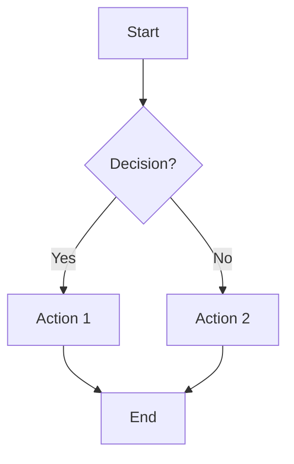
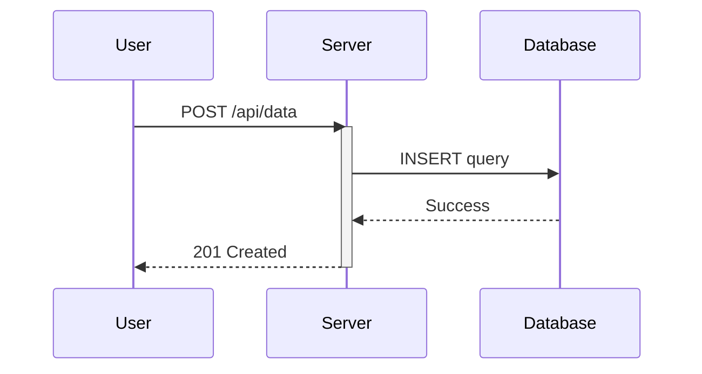
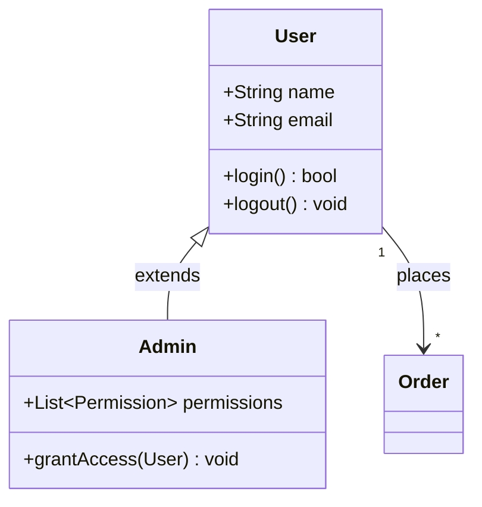
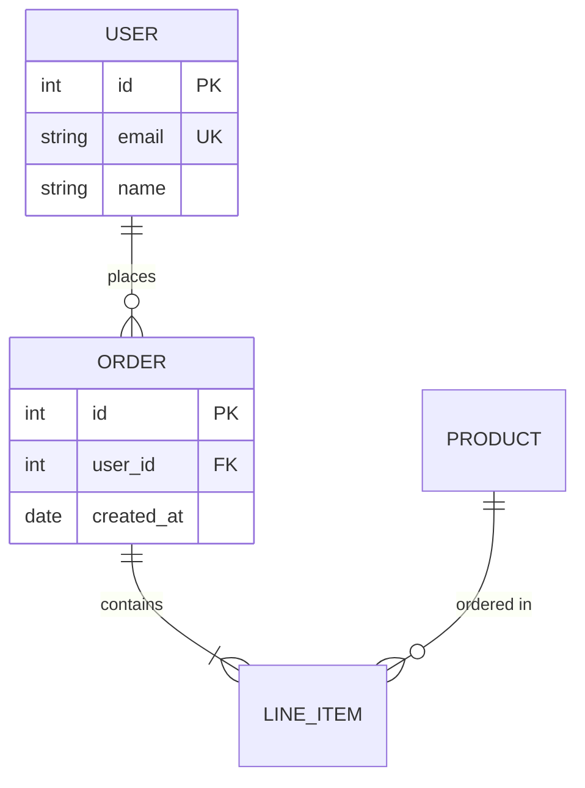
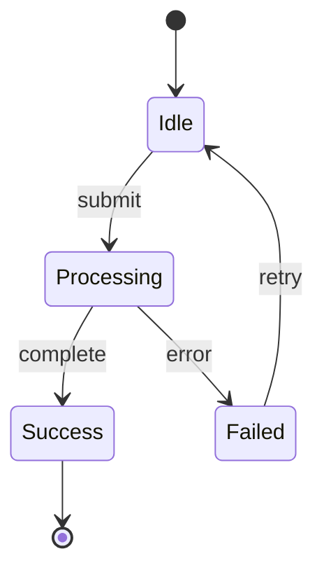
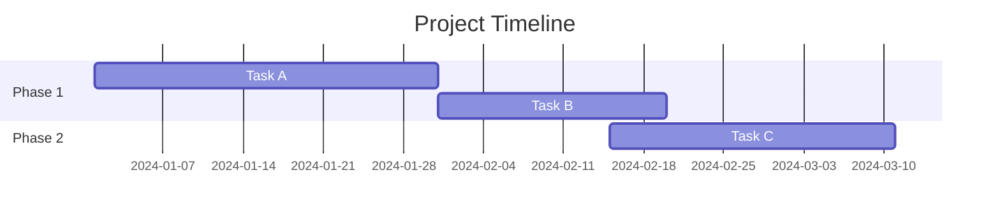
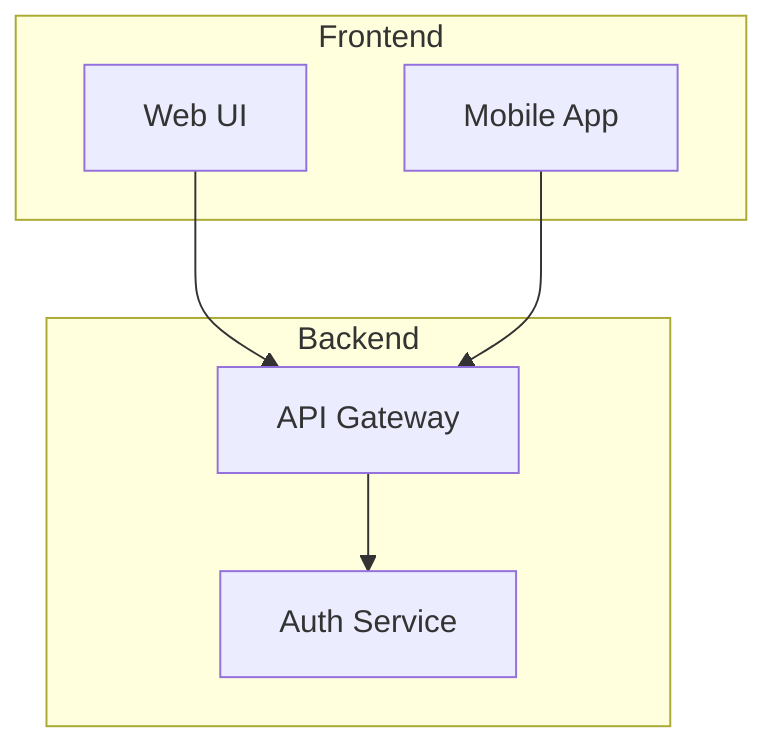
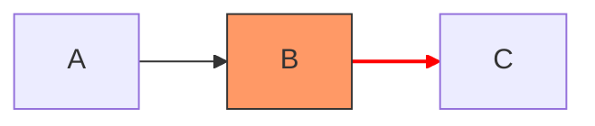

# Mermaid Diagrams Skill

Create Mermaid diagrams that render correctly and communicate clearly. Mermaid files (`.mermaid`) render as visual artifacts in Claude.

## Workflow

1. Identify the best diagram type for the request
2. Generate clean Mermaid syntax following the patterns below
3. Save as `.mermaid` file to `/mnt/user-data/outputs/`

## Diagram Type Selection

| Request Type | Diagram | Direction |
|-------------|---------|-----------|
| Processes, decisions, workflows | `flowchart` | TB or LR |
| API calls, service interactions, time-ordered events | `sequenceDiagram` | (implicit LR) |
| OOP structures, data models, inheritance | `classDiagram` | TB |
| Database schemas, entity relationships | `erDiagram` | (auto) |
| Object lifecycles, FSMs | `stateDiagram-v2` | TB or LR |
| Project timelines, schedules | `gantt` | (implicit LR) |
| Git branches, commits | `gitGraph` | LR |
| Hierarchical data, org charts | `flowchart` with subgraphs | TB |

## Quick Syntax Reference

### Flowchart

Node shapes: `[rect]` `(rounded)` `{diamond}` `([stadium])` `[[subroutine]]` `[(database)]` `((circle))` `>flag]` `{{hexagon}}`

### Sequence Diagram

Arrows: `->>` (solid async), `-->>` (dotted response), `--)` (async no arrow), `-x` (lost message)

### Class Diagram

Relations: `<|--` (inheritance), `*--` (composition), `o--` (aggregation), `-->` (association), `..>` (dependency)

### ER Diagram

Cardinality: `||` (one), `o|` (zero or one), `}|` (one or more), `}o` (zero or more)

### State Diagram

### Gantt Chart

## Best Practices

**Node IDs**: Use meaningful names (`userService`, `validateInput`) not single letters (`A`, `B`).

**Labels**: Keep under 40 characters. Use ` ` for line breaks in longer text.

**Direction**: Use `TB` (top-bottom) for hierarchies, `LR` (left-right) for sequences/timelines.

**Subgraphs**: Group related nodes to improve readability:

**Styling**: Apply sparingly for emphasis:

## Common Pitfalls

| Issue | Problem | Solution |
|-------|---------|----------|
| Special chars in labels | `(`, `)`, `[`, `]` break parsing | Wrap in quotes: `A["processData()"]` |
| Colons in labels | Interpreted as styling | Escape: `A["Key: Value"]` |
| Long node names | Diagram becomes unreadable | Use short IDs with descriptive labels: `db[(Database)]` |
| Too many nodes | Cluttered, hard to follow | Split into multiple diagrams or use subgraphs |
| Missing quotes | Spaces in labels fail | Always quote multi-word labels |
| Arrow syntax mixing | Different diagrams use different arrows | Check diagram type (flowchart uses `-->`, sequence uses `->>`) |

## Output

Save diagrams to `/mnt/user-data/outputs/diagram-name.mermaid` for rendering.

For detailed syntax reference and advanced patterns, see [references/syntax-guide.md](references/syntax-guide.md).
