# Mermaid Syntax Reference Guide

Comprehensive syntax reference for all Mermaid diagram types. Load this file when creating complex diagrams or when the user needs advanced features.

## Table of Contents
- [Flowchart Advanced](#flowchart-advanced)
- [Sequence Diagram Advanced](#sequence-diagram-advanced)
- [Class Diagram Advanced](#class-diagram-advanced)
- [ER Diagram Advanced](#er-diagram-advanced)
- [State Diagram Advanced](#state-diagram-advanced)
- [Gantt Chart Advanced](#gantt-chart-advanced)
- [Git Graph](#git-graph)
- [Pie Chart](#pie-chart)
- [Mindmap](#mindmap)
- [Timeline](#timeline)
- [Styling Reference](#styling-reference)
- [Escaping and Special Characters](#escaping-and-special-characters)

---

## Flowchart Advanced

### All Node Shapes
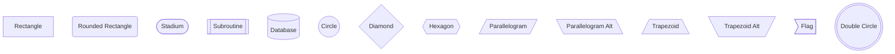

### Link Types
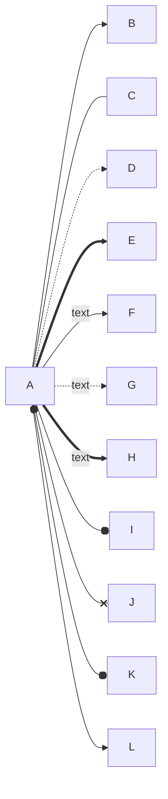

### Link Length Control
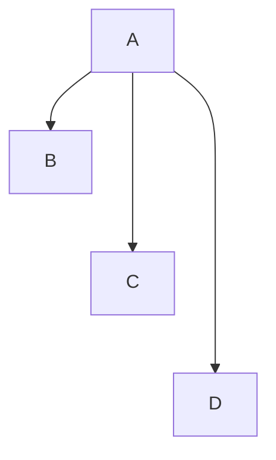

### Complex Subgraphs
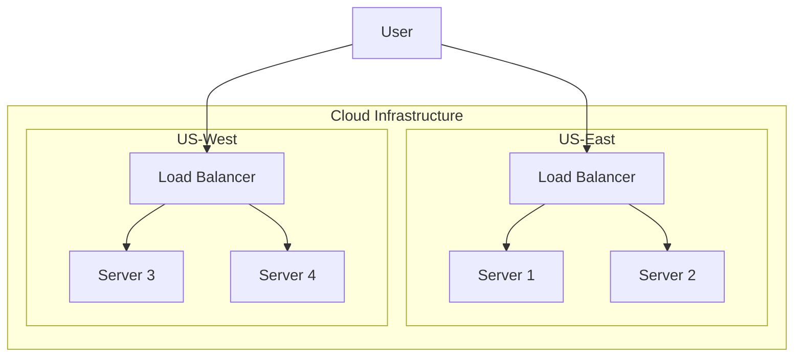

### Interactions (for web embedding)
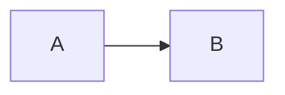

---

## Sequence Diagram Advanced

### All Arrow Types
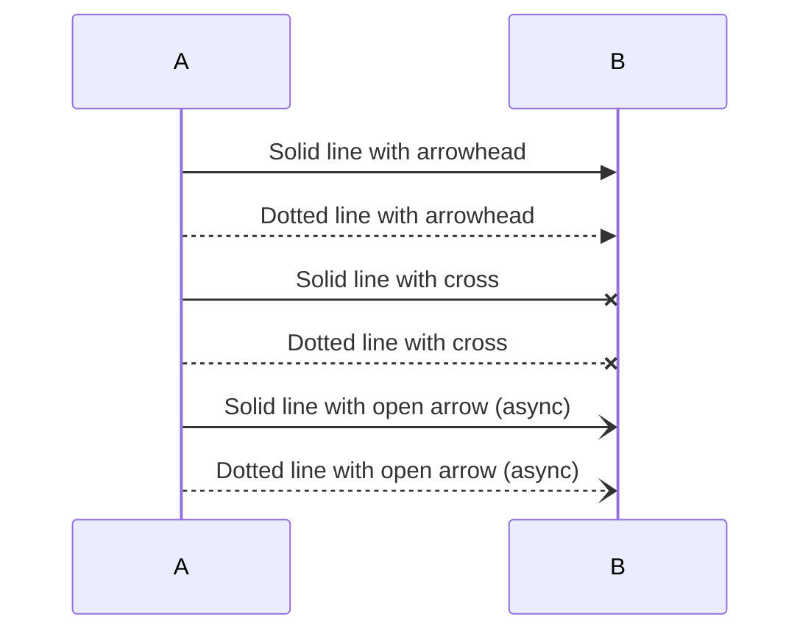

### Activation and Nesting
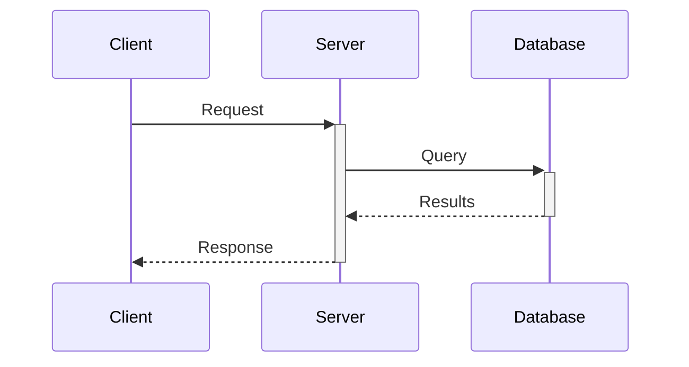

### Loops, Conditionals, and Parallel
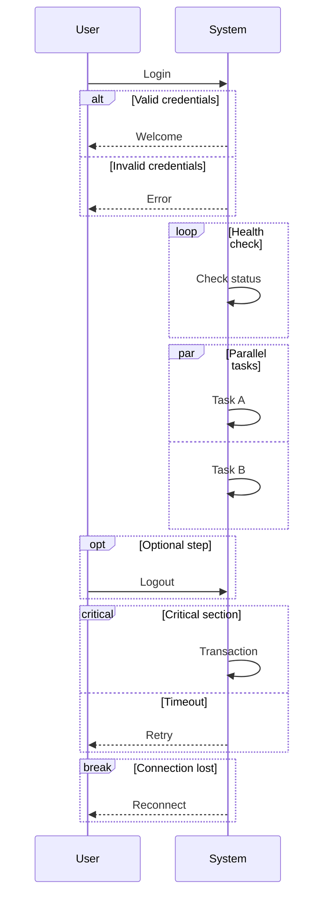

### Notes
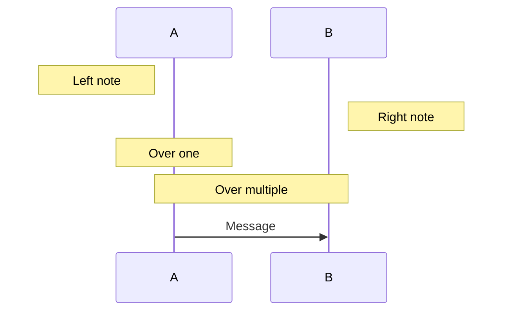

### Actors vs Participants
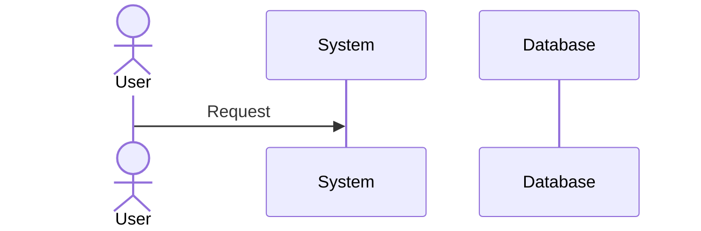

### Autonumbering
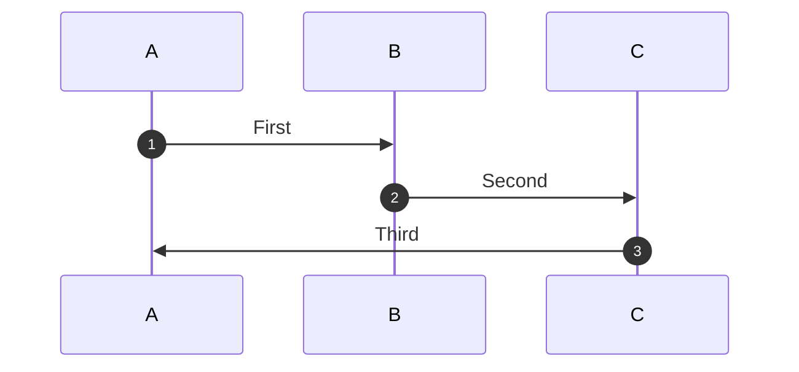

---

## Class Diagram Advanced

### Visibility Modifiers
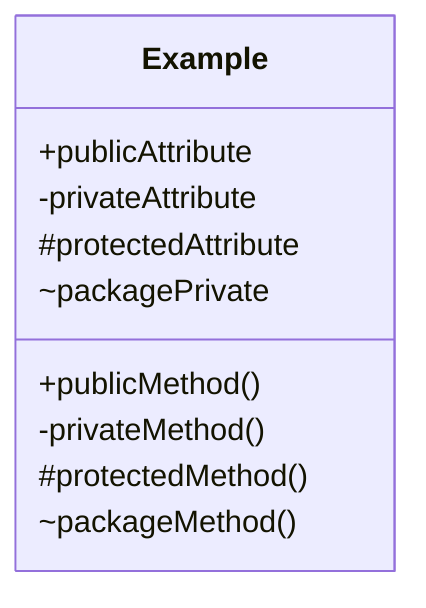

### Generic Types
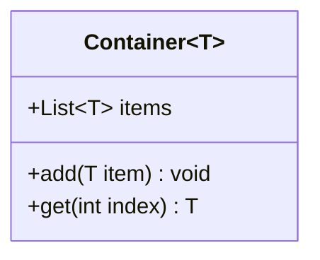

### All Relationship Types
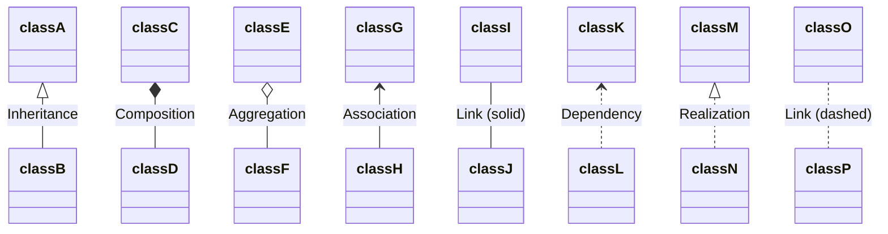

### Cardinality
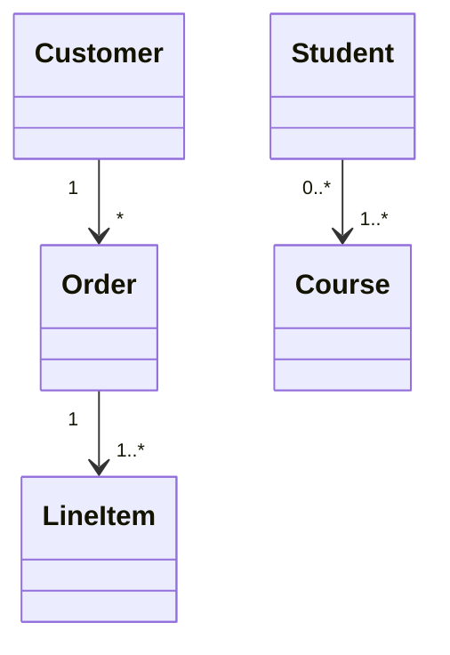

### Annotations and Stereotypes
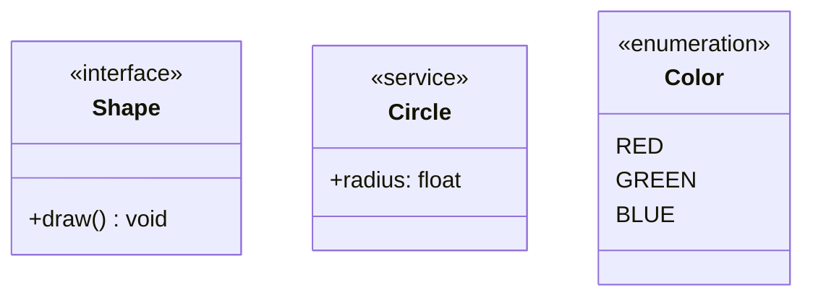

### Namespaces
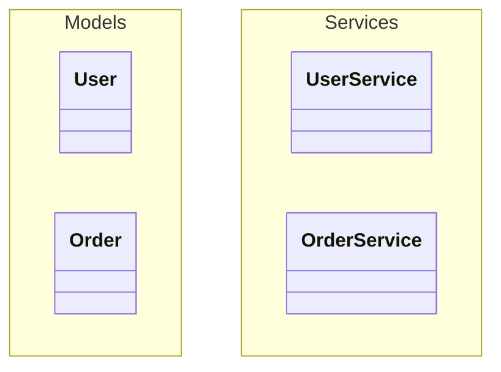

---

## ER Diagram Advanced

### All Cardinality Options
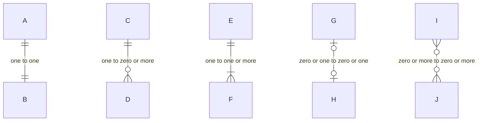

### Attribute Types and Keys
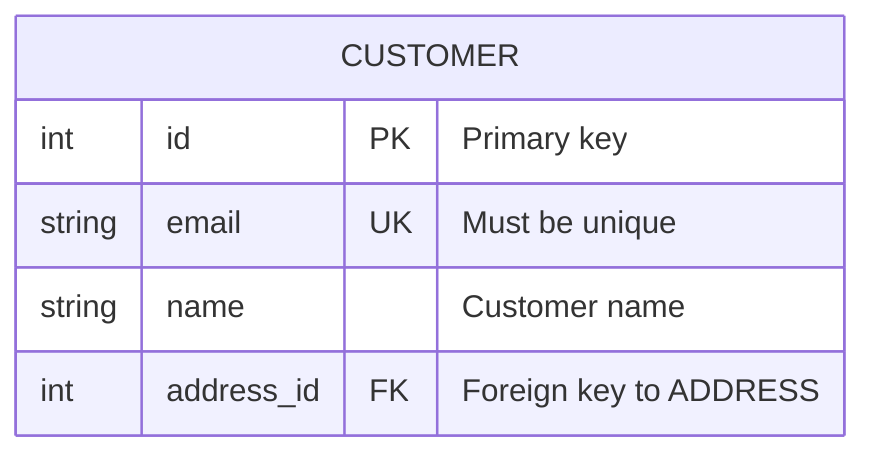

### Complex Schema Example
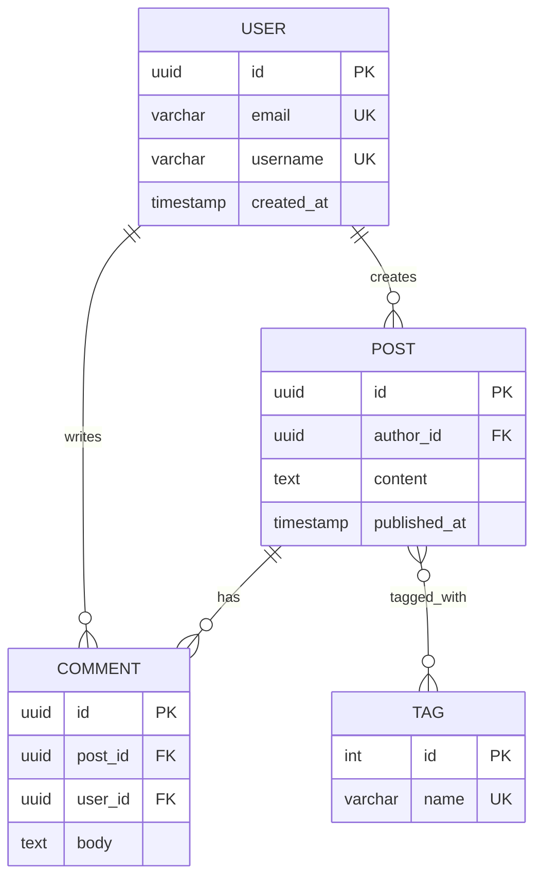

---

## State Diagram Advanced

### Composite States
```mermaid
stateDiagram-v2
    [*] --> Active
    
    state Active {
        [*] --> Idle
        Idle --> Processing : start
        Processing --> Idle : complete
    }
    
    Active --> Suspended : suspend
    Suspended --> Active : resume
    Active --> [*] : terminate
```

### Forks and Joins (Parallel States)
```mermaid
stateDiagram-v2
    [*] --> fork_state
    state fork_state <<fork>>
    fork_state --> State2
    fork_state --> State3
    
    state join_state <<join>>
    State2 --> join_state
    State3 --> join_state
    join_state --> State4
    State4 --> [*]
```

### Choice Pseudostate
```mermaid
stateDiagram-v2
    [*] --> IsValid
    state IsValid <<choice>>
    IsValid --> Valid : if valid
    IsValid --> Invalid : if invalid
    Valid --> [*]
    Invalid --> [*]
```

### Notes
```mermaid
stateDiagram-v2
    [*] --> Active
    Active --> Inactive
    
    note right of Active
        This is a note
        spanning multiple lines
    end note
    
    note left of Inactive : Short note
```

### Concurrency
```mermaid
stateDiagram-v2
    [*] --> Active
    state Active {
        [*] --> Working
        --
        [*] --> Listening
    }
```

---

## Gantt Chart Advanced

### Task Dependencies and Milestones
```mermaid
gantt
    title Development Timeline
    dateFormat YYYY-MM-DD
    excludes weekends
    
    section Planning
        Requirements    :done, req, 2024-01-01, 14d
        Design          :active, des, after req, 21d
        Review          :milestone, m1, after des, 0d
    
    section Development
        Backend         :crit, dev1, after des, 30d
        Frontend        :dev2, after des, 25d
        Integration     :after dev1 dev2, 10d
    
    section Testing
        QA Testing      :test, after dev1, 14d
        UAT             :after test, 7d
```

### Task States
- `done` - Completed task
- `active` - Current task
- `crit` - Critical path task
- `milestone` - Zero-duration milestone

---

## Git Graph

```mermaid
gitGraph
    commit id: "Initial"
    branch develop
    checkout develop
    commit id: "Feature A"
    commit id: "Feature B"
    checkout main
    merge develop id: "Merge develop"
    commit id: "Hotfix"
    branch release
    checkout release
    commit id: "Release prep"
    checkout main
    merge release tag: "v1.0"
```

### Options
```mermaid
gitGraph TB:
    commit
    branch develop
    commit
    checkout main
    merge develop
```

---

## Pie Chart

```mermaid
pie showData
    title Browser Market Share
    "Chrome" : 65
    "Safari" : 19
    "Firefox" : 8
    "Edge" : 5
    "Other" : 3
```

---

## Mindmap

```mermaid
mindmap
    root((Project))
        Planning
            Requirements
            Timeline
            Budget
        Development
            Frontend
                React
                CSS
            Backend
                API
                Database
        Testing
            Unit Tests
            Integration
            E2E
```

---

## Timeline

```mermaid
timeline
    title Product History
    2020 : Initial concept
         : Market research
    2021 : MVP development
         : Beta launch
    2022 : Public release
         : Series A funding
    2023 : International expansion
```

---

## Styling Reference

### Class-based Styling
```mermaid
flowchart LR
    A:::success --> B:::warning --> C:::error
    
    classDef success fill:#9f6,stroke:#333
    classDef warning fill:#ff9,stroke:#333
    classDef error fill:#f66,stroke:#333
```

### Inline Styling
```mermaid
flowchart LR
    A --> B --> C
    style A fill:#bbf,stroke:#333,stroke-width:2px
    style B fill:#fbf,stroke:#f66,stroke-dasharray: 5 5
```

### Link Styling
```mermaid
flowchart LR
    A --> B --> C
    linkStyle 0 stroke:#ff3,stroke-width:4px
    linkStyle 1 stroke:#f00,stroke-width:2px,stroke-dasharray: 3
```

### Theme Configuration
```mermaid
%%{init: {'theme': 'forest'}}%%
flowchart LR
    A --> B --> C
```

Available themes: `default`, `forest`, `dark`, `neutral`, `base`

---

## Escaping and Special Characters

### Characters Requiring Quotes
Always wrap labels in quotes when they contain:
- Parentheses: `A["getData()"]`
- Brackets: `A["array[0]"]`
- Colons: `A["Key: Value"]`
- Semicolons: `A["a; b"]`
- Pipes: `A["a | b"]`
- Hashes: `A["#channel"]`

### HTML Entities
```mermaid
flowchart LR
    A["Less than: &lt;"]
    B["Greater than: &gt;"]
    C["Ampersand: &amp;"]
```

### Line Breaks in Labels
```mermaid
flowchart LR
    A["Line 1<br>Line 2<br>Line 3"]
```

### Unicode
```mermaid
flowchart LR
    A["✓ Success"] --> B["⚠ Warning"] --> C["✗ Error"]
```
